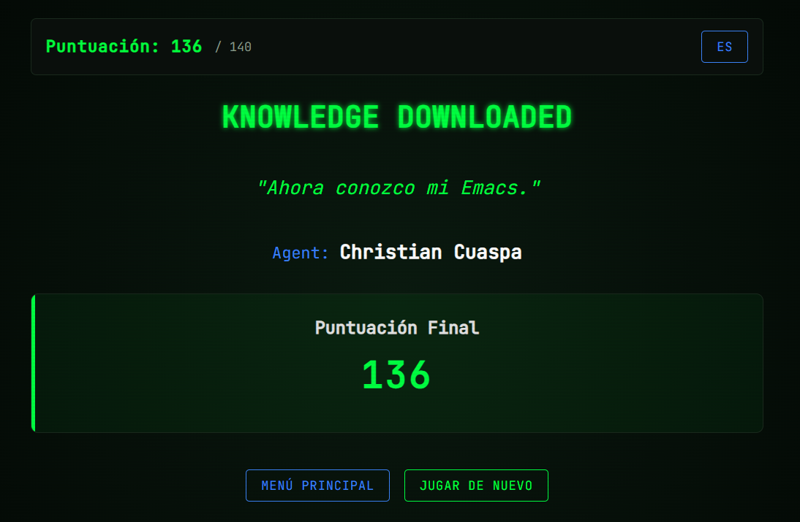
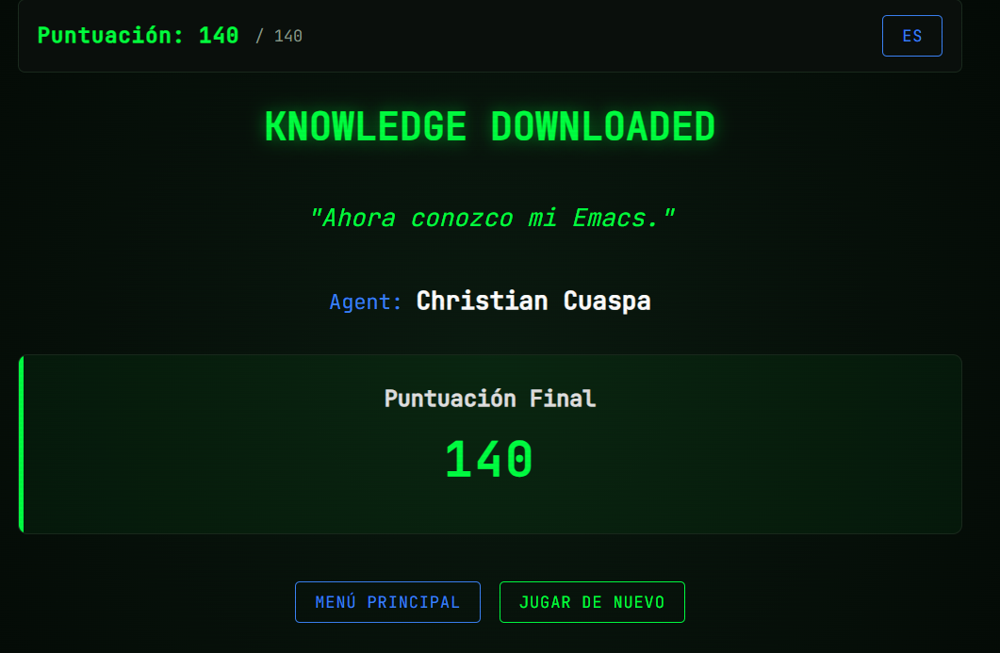
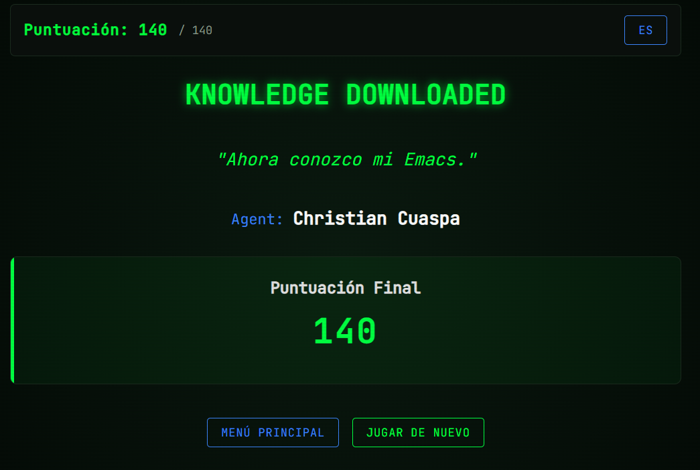
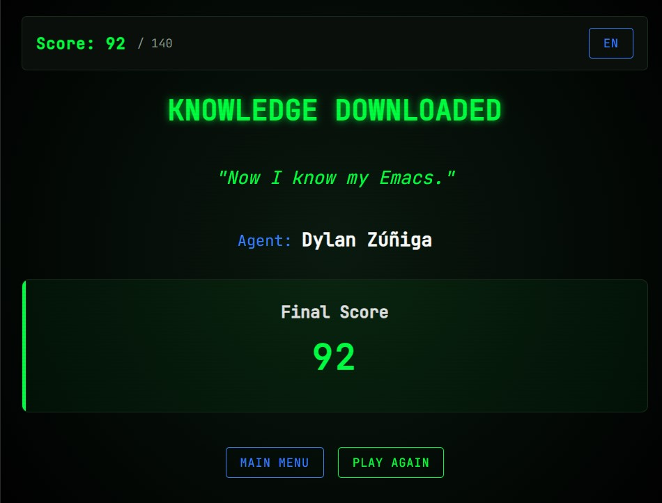
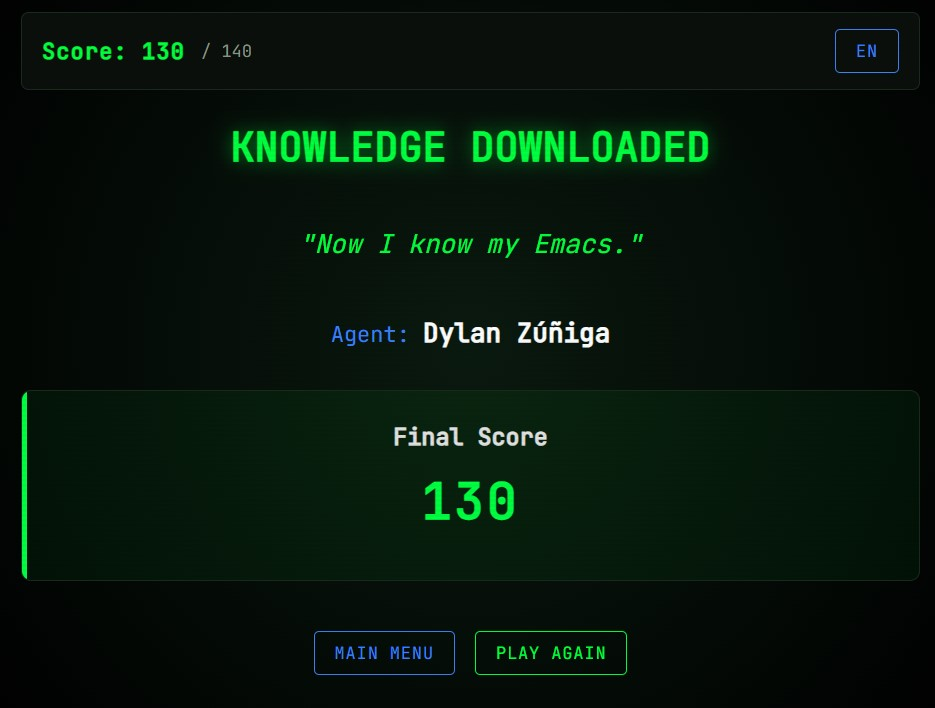
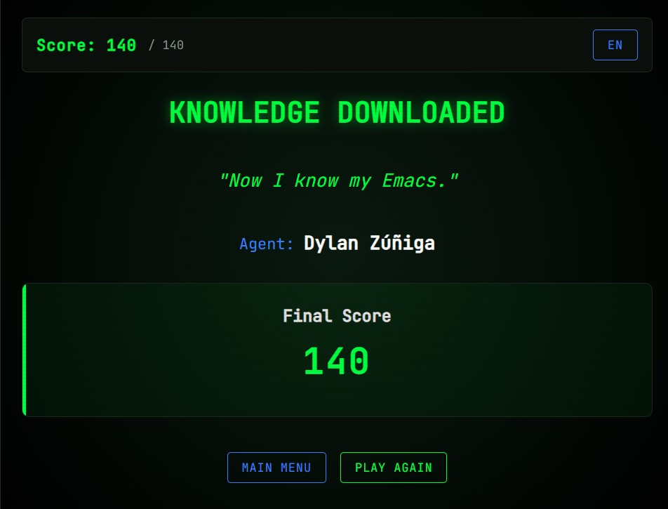
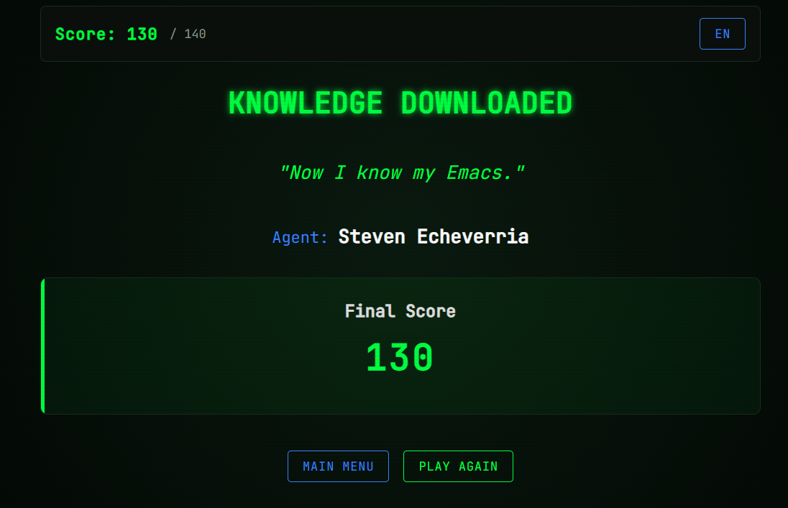
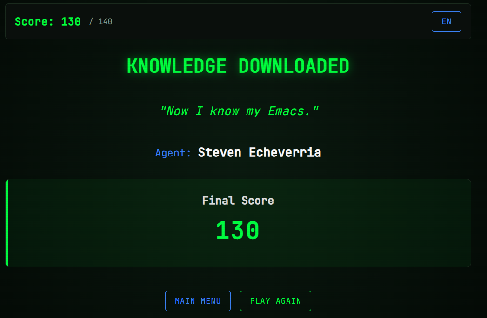
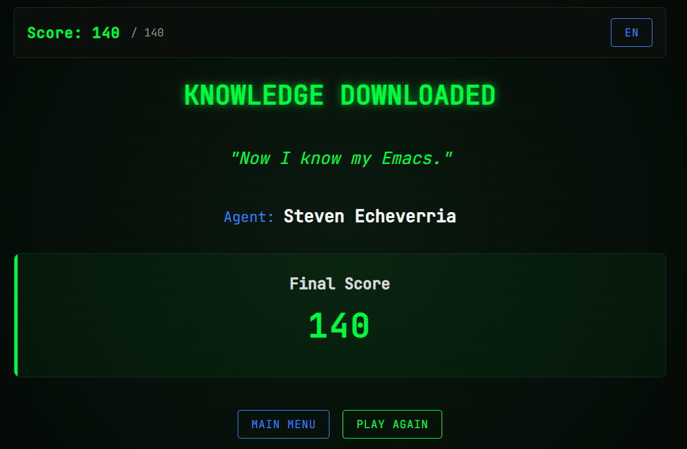

#+options: ':nil *:t -:t ::t <:t H:3 \n:nil ^:t arch:headline
#+options: author:t broken-links:nil c:nil creator:nil
#+options: d:(not "LOGBOOK") date:t e:t email:nil expand-links:t f:t
#+options: inline:t num:t p:nil pri:nil prop:nil stat:t tags:t
#+options: tasks:t tex:t timestamp:t title:t toc:nil todo:t |:t
#+title: Taller de Configuración de Entorno WSL
#+date: 2026-04-18
#+author: Christian Cuaspa, Danny Lanchimba, Steven Echeverria, Dylan Zuñiga
#+email: christian.cuaspa@epn.edu.ec, danny.lanchimba@epn.edu.ec, steven.echeverria@epn.edu.ec, dylan.zuniga@epn.edu.ec
#+language: Espanol
#+select_tags: export
#+exclude_tags: noexport
#+creator: Emacs 27.1 (Org mode 9.7.5)
#+cite_export:

#+latex_class: article
#+latex_class_options:
#+latex_header:
#+latex_header_extra:
#+description:
#+keywords:
#+subtitle:
#+latex_footnote_command: \footnote{%s%s}
#+latex_engraved_theme:
#+latex_compiler: pdflatex

#+latex_header: \usepackage{fancyhdr}
#+latex_header: \usepackage[top=25mm, left=25mm, right=25mm]{geometry}
#+latex_header: \usepackage{longtable}
#+latex_header: \fancyhead[R]{}
#+latex_header: \setlength\headheight{43.0pt}
#+LATEX_HEADER: \usepackage{tabularx}
#+LATEX_HEADER: \usepackage{longtable}

#+begin_export latex
\fancyhead[C]{\includegraphics[scale=0.05]{../images/logoEPN.jpg}\\
ESCUELA POLITÉCNICA NACIONAL\\FACULTAD DE INGENIERÍA DE SISTEMAS\\
ARQUITECTURA DE COMPUTADORES}
\thispagestyle{fancy}
#+end_export

* Objetivos

- Configurar y validar el entorno de trabajo para la asignatura de Arquitectura de Computadores en Linux o WSL.
- Verificar la instalación de herramientas base: mamba/anaconda (Python), Emacs y \LaTeX.
- Documentar evidencias técnicas mediante capturas y comandos ejecutados.

* Instrucciones

1. Realice todas las actividades en Linux o en WSL.
2. En cada sección ejecute los comandos solicitados y registre la salida en el bloque correspondiente.
3. Guarde el archivo y exporte a pdf con el comando `org-latex-export-to-pdf`.
4. Verifique que estén todos los nombres de los integrantes del grupo
   de trabajo. Los grupos para este trabajo están en [[https://epnecuador.sharepoint.com/:x:/s/ICCD332-ArquitecturaComputadores/IQCjNuELSDbJTb42EfrLL2ksATBSbitbZ9_iFLJxIiCtSr0?e=gowv5I][Equipos de Trabajo]].
5. Verifique que en las distintas secciones de este archivo esté
   identificado con nombre e email el aporte del estudiante.

Si requiere insertar una imagen, crear una carpeta ~images~ y colocar
la imagen dentro. Para llamar la imagen desde Emacs use ~C-c C-l~ y
busque el archivo o escriba:Puede insertar una imagen con la sintaxis:

#+begin_src org
[[./images/image1.jpg]]
#+end_src
* Actividades
** Configuración de WSL con Ubuntu, \LaTeX, Python e Emacs

1. Verificación de entorno mamba/anaconda
   1. Active WSL (si aplica) y su entorno de trabajo.
   2. Ejecute ~mamba info~ con ~C-c C-c~ dentro del bloque de código.
   3. Si el comando falla, active un entorno con ~mamba activate iccd332~ e intente de nuevo.
   
   #+begin_src shell :exports both :results verbatim
     mamba info
   #+end_src
  
   #+RESULTS:
   #+begin_example

	  libmamba version : 2.5.0
	     mamba version : 2.5.0
	      curl version : libcurl/8.19.0 OpenSSL/3.6.1 zlib/1.3.2 zstd/1.5.7 libssh2/1.11.1 nghttp2/1.68.1 mit-krb5/1.22.2
	libarchive version : libarchive 3.8.6 zlib/1.3.2 liblzma/5.8.2 bz2lib/1.0.8 liblz4/1.10.0 libzstd/1.5.7 liblzo2/2.10 openssl/3.5.5 libb2/bundled
<<<<<<< HEAD
	  envs directories : /home/christian_cuaspa/miniforge3/envs
	     package cache : /home/christian_cuaspa/miniforge3/pkgs
			     /home/christian_cuaspa/.mamba/pkgs
	       environment : iccd332 (active)
	      env location : /home/christian_cuaspa/miniforge3/envs/iccd332
	 user config files : /home/christian_cuaspa/.mambarc
    populated config files : /home/christian_cuaspa/miniforge3/.condarc
	  virtual packages : __unix=0=0
			     __linux=6.6.87=0
			     __glibc=2.39=0
			     __archspec=1=x86_64_v3
		  channels : https://conda.anaconda.org/conda-forge/linux-64
			     https://conda.anaconda.org/conda-forge/noarch
	  base environment : /home/christian_cuaspa/miniforge3
=======
	  envs directories : /home/stevenech/miniforge3/envs
	     package cache : /home/stevenech/miniforge3/pkgs
			     /home/stevenech/.mamba/pkgs
	       environment : iccd332 (active)
	      env location : /home/stevenech/miniforge3/envs/iccd332
	 user config files : /home/stevenech/.mambarc
    populated config files : /home/stevenech/miniforge3/.condarc
	  virtual packages : __unix=0=0
			     __linux=6.6.87=0
			     __glibc=2.39=0
			     __archspec=1=x86_64_v4
		  channels : https://conda.anaconda.org/conda-forge/linux-64
			     https://conda.anaconda.org/conda-forge/noarch
	  base environment : /home/stevenech/miniforge3
>>>>>>> origin/estudianteD
		  platform : linux-64
   #+end_example

2. Verificación de Python
   1. Active el entorno ~iccd332~ para abrir Emacs con ~mamba activate iccd332~.
   2. Ejecute ~python --version~ en la consola y desde Emacs.

   #+begin_src shell :exports both :results verbatim
    python --version
   #+end_src

   #+RESULTS:
   : Python 3.14.4

3. Verificación de Emacs
   Ejecute ~emacs --version~ en la consola y desde Emacs.

   #+begin_src shell :exports both :results verbatim
   emacs --version
   #+end_src

   #+RESULTS:
   : GNU Emacs 29.3
   : Copyright (C) 2024 Free Software Foundation, Inc.
   : GNU Emacs comes with ABSOLUTELY NO WARRANTY.
   : You may redistribute copies of GNU Emacs
   : under the terms of the GNU General Public License.
   : For more information about these matters, see the file named COPYING.

4. Verificación de LaTeX
   Ejecute ~latex --version~ en la consola y desde Emacs.

   #+begin_src shell :exports both :results verbatim
   latex --version
   #+end_src

   #+RESULTS:
   #+begin_example
   pdfTeX 3.141592653-2.6-1.40.25 (TeX Live 2023/Debian)
   kpathsea version 6.3.5
   Copyright 2023 Han The Thanh (pdfTeX) et al.
   There is NO warranty.  Redistribution of this software is
   covered by the terms of both the pdfTeX copyright and
   the Lesser GNU General Public License.
   For more information about these matters, see the file
   named COPYING and the pdfTeX source.
   Primary author of pdfTeX: Han The Thanh (pdfTeX) et al.
   Compiled with libpng 1.6.43; using libpng 1.6.43
   Compiled with zlib 1.3; using zlib 1.3
   Compiled with xpdf version 4.04
   #+end_example

5. Registro de problemas y solución aplicada

Complete la siguiente tabla si tuvo errores durante la configuración:

#+ATTR_LATEX: :environment tabularx :width \textwidth :align lXX
| *Herramienta*           | *Problema observado*         | *Solucion aplicada*                                                                                                             |
|-------------------------+------------------------------+---------------------------------------------------------------------------------------------------------------------------------|
| Emacs(Christian Cuaspa) | Ejecución de C-c C-c fallida | Ejecucion Eval expresion y luego introducir (org-babel-do-load-languages 'org-babel-load-languages '((shell . t) (python . t))) |
|                         |                              |                                                                                                                                 |
|                         |                              |                                                                                                                                 |

** Comandos Emacs Tutorial
Seguir el tutorial integrado en Emacs al respecto de la navegación y
operaciones más frecuentes. El tutorial puede ser accedido en Español
utilizando el comando:

#+begin_src emacs-lisp
M-x help-with-tutorial-spec-language
#+end_src

Realice los ejercicios del tutorial (al menos un 80% del texto) y
complete la siguiente tabla con los comandos que considere de mayor
interés. Verifique que en la parte superior se active el menú de
tabla. Dentro de la región de la tabla puede dar C-c C-c para alinear
automáticamente la tabla al contenido del texto que escriba. Para
generar una nueva fila escriba presione la tecla TAB

<Estudiante A> Christian Cuaspa
#+ATTR_LATEX: :environment longtable :align |p{0.2\linewidth}|p{0.3\linewidth}|p{0.2\linewidth}|p{0.3\linewidth}|
| *Comando* | *Descripción*                                   | *Comando*  | *Descripción*                                                                     |
|-----------+-------------------------------------------------+------------+-----------------------------------------------------------------------------------|
| ~M-d~     | Elimina la siguiente palabra despues del cursor | ~C-<SPC>~  | Selciona el contenido desde la posición actual del cursor hasta su nueva posición |
| ~M-k~     | Elimina hasta el final de una oración           | ~C-w~      | Elimina lo seleccionado con C-<SPC>                                               |
| ~C-/~     | Deshace una acción                              | ~C-x C-b~  | Muestra la lista de buffers                                                       |

<Estudiante B>
#+ATTR_LATEX: :environment longtable :align |p{0.2\linewidth}|p{0.3\linewidth}|p{0.2\linewidth}|p{0.3\linewidth}|
| *Comando*         | *Descripción*               | *Comando* | *Descripción*                     |
|-------------------+-----------------------------+-----------+-----------------------------------|
| ~C-c C-e # latex~ | Insertar template de  latex | ~C-x C-s~ | Guardar los cambios en el archivo |
|                   |                             |           |                                   |
|                   |                             |           |                                   |

<Estudiante C>
#+ATTR_LATEX: :environment longtable :align |p{0.2\linewidth}|p{0.3\linewidth}|p{0.2\linewidth}|p{0.3\linewidth}|
| *Comando*   | *Descripción* | *Comando* | *Descripción*                     |
|-------------+---------------+-----------+-----------------------------------|
| ~C-/ o C-_~ | Deshacer      | ~C-x C-u~ | Convierte una región a mayúsculas |
| ~C-g C-/~   | Rehacer       | ~C-x C-l~ | Convierte una región a minúsculas |
|             |               |           |                                   |

<Estudiante D>
#+ATTR_LATEX: :environment longtable :align |p{0.2\linewidth}|p{0.3\linewidth}|p{0.2\linewidth}|p{0.3\linewidth}|
| *Comando* | *Descripción*                                            | *Comando* | *Descripción*                                        |
|-----------+----------------------------------------------------------+-----------+------------------------------------------------------|
| ~C-e~     | Mover el cursor al final de una línea                    | ~C-y~     | Pegar un texto copiado o borrado anteriormente       |
| ~C-x-1~   | Quedarme solo con la ventana activa y eliminar las demás | ~C-x b~   | Abrir otro buffer                                    |
| ~M-k~     | Eliminar una oración completa                            | ~M-C-v~   | Desplazar el buffer que se encuentra en otra ventana |
** Comandos Emacs Juego
En la anterior sección usted revisó los comandos de mayor interés
sobre la manipulación de Emacs. Es hora de poner en práctica sus
conocimientos. Realice unas 3 visitas al juego  [[https://chat.qwen.ai/s/deploy/t_23ff57ef-b59a-4bd7-9b79-54679b33686d][Emacs-Trainer]] y apunte
en la siguiente tabla su puntaje.

Estudiante A: 
|-----------+---------|
| iteración | Puntaje |
|-----------+---------|
|         1 |    136  |
|         2 |    140  |
|         3 |    140  |
|-----------+---------|

Estudiante B: 
|-----------+---------|
| iteración | Puntaje |
|-----------+---------|
|         1 |         |
|         2 |         |
|         3 |         |
|-----------+---------|

#+begin_src org
[[./estudianteB-game.png]]
#+end_src

Estudiante C: 
|-----------+---------|
| iteración | Puntaje |
|-----------+---------|
|         1 |    92   |
|         2 |    130  |
|         3 |    140  |
|-----------+---------|

Estudiante D: 
|-----------+---------|
| iteración | Puntaje |
|-----------+---------|
|         1 |     130 |
|         2 |     130 |
|         3 |     140 |
|-----------+---------|

** Usando Emacs para tener Ayuda sobre Emacs
¿Qué comandos le resultan más fáciles de usar y cuáles le son más
extraños? Identifique 4 comandos que le sean fáciles y 4 que le
resulten complicados. Revise qué dice la ayuda de Emacs sobre cada
comando y escriba en sus palabras el para qué sirve.

Para consultar lo que hace un comando ejecute:
1. ~C-h k~
2. Emacs le preguntara cuál es la combinación de la que requiere
   ayuda. Presione las teclas del comando. Por ejemplo, ~C-x C-f~
3. Emacs abrirá un nuevo buffer con la descripción del comando.
4. Cambie al buffer de la ayuda con ~C-x o~
5. Seleccione el primer párrafo de ayuda ubicando el cursor al inicio
   del párrafo y activando la marcación de texto con
   ~C-SPC~. Seleccione avanzando por palabras ~M-f~ o directamente
   toda la linea ~C-e~
6. Una vez seleccionado, copie el texto con ~M-w~.
7. Regrese al buffer anterior con ~C-x o~.
8. Pegue el texto en <Pegar lo que dice el...> con ~C-y~

**Comandos Fáciles**
1. **Christian Cuaspa:** <C-x 1>. <C-x 1 runs the command delete-other-windows (found in global-map),
                          which is an interactive native-compiled Lisp function in ‘window.el’.>

2. **Estudiante B:** <Poner el comando>. <Pegar lo que dice el primer párrafo de la ayuda>
3. **Estudiante C:** <Poner el comando>. <Pegar lo que dice el primer párrafo de la ayuda> 
4. **Estudiante D:** ~C-p~. C-p runs the command previous-line (found in global-map), which is an
interactive native-compiled Lisp function in ‘simple.el’. Sirve para mover el cursor a una línea anterior.

**Comandos Difíciles**
1. **Estudiante A:** <M-x recover-file>. <recover-file is an interactive native-compiled Lisp function
                      in ‘files.el’.>
2. **Estudiante B:** <Poner el comando>. <Pegar lo que dice el primer párrafo de la ayuda>
3. **Estudiante C:** <Poner el comando>. <Pegar lo que dice el primer párrafo de la ayuda>
4. **Estudiante D:** ~C-x 4 C-f. C-x 4 C-f runs the command find-file-other-window (found in
global-map), which is an interactive native-compiled Lisp function in
‘files.el’. Permite abrir un archivo específico en otra ventana.

* Equipo de Trabajo
Complete la información de los integrantes de grupo e indique el líder
de grupo.

|-------------------+------------------------------+-------------|
| Nombre            | email                        | Rol         |
|-------------------+------------------------------+-------------|
| Christian Cuaspa  | christian.cuaspa@epn.edu.ec  | líder       |
| Danny Lanchimba   | danny.lanchimba@epn.edu.ec   | colaborador |
| Dylan Zuñiga      | dylan.zuniga@epn.edu.ec      | colaborador |
| Steven Echeverria | steven.echeverria@epn.edu.ec | colaborador |
|                   |                              |             |
|-------------------+------------------------------+-------------|

* Verificación de Entregables [85%]:
Ejecute ~C-c C-c~ sobre los ítems de tarea según se hayan cumplido o
no. Si un ítem no pudo realizarse apunte en la siguiente sección las
razones al respecto.
- [X] Verificación de configuración de entorno WSL y paquetes del curso. 
- [X] Tutorial de Comandos Emacs realizado.
- [X] Captura de Imágenes y puntajes de Emacs Trainer App.
- [X] Usando Emacs para tener ayuda sobre Emacs
- [ ] Verifique que estén los nombres de los integrantes del equipo e
  identificado el líder.
- [X] Revisión de ortografía con ~ispell~ en el buffer
- [X] Generación de Archivo PDF ~M-x org-latex-export-to-pdf~
** Problemas con la Tarea:
- Tarea $X_1$ no pudo completarse debido a
- Tarea $X_2$ no pudo completarse debido a
